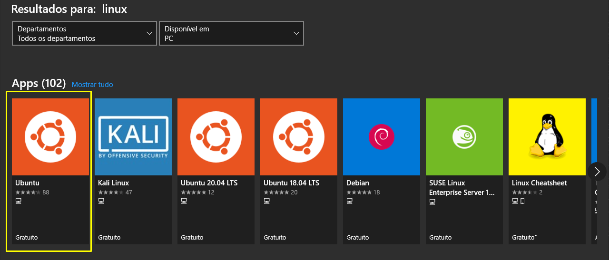
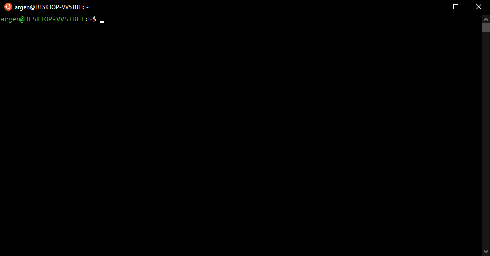

<p align="center">
  <a href="https://www.pixeon.com" target="blank"></a>
</p>

## SQL SERVER NO DOCKER COM WSL2

Nesse tutorial vamos criar um container docker no WLS2, utlizando docker-compose 
para subir nossos sevirços, também vamos executar um script que fará a impotação da 
da base smartqa no nosso container.

### O que é o WSL2
Em 2016, a Microsoft anunciou a possibilidade de rodar o Linux dentro do Windows 10 como um subsistema e o nome a isto foi dado de WSL ou Windows Subsystem for Linux.

O acesso ao sistema de arquivos no Windows 10 pelo Linux era simples e rápido, porém não tínhamos uma execução completa do kernel do Linux, além de outros artefatos nativos e isto impossibilitava a execução de várias tarefas no Linux, uma delas é o Docker.

Em 2019, a Microsoft anunciou o WSL 2, com uma dinâmica aprimorada em relação a 1ª versão:

Execução do kernel completo do Linux.
Melhor desempenho para acesso aos arquivos dentro do Linux.
Compatibilidade completa de chamada do sistema.
O WSL 2 foi lançado oficialmente no dia 28 de maio de 2020.

Com WSL 2 é possível executar Docker no Linux usando o Windows 10/11.

### O que é Docker
Docker é uma plataforma open source que possibilita o empacotamento de uma aplicação dentro de um container. Uma aplicação consegue se adequar e rodar em qualquer máquina que tenha essa tecnologia instalada.

### Porque usar WSL 2 + Docker para desenvolvimento
Configurar ambientes de desenvolvimento no Windows sempre foi burocrático e complexo, além do desempenho de algumas ferramentas não serem totalmente satisfatórias.

Com o nascimento do Docker este cenário melhorou bastante, pois podemos montar nosso ambiente de desenvolvimento baseado em Unix, de forma independente e rápida, e ainda unificada com outros sistemas operacionais


#### Requisitos mínimos

* Windows 10 Home ou Professional 
  - Versão 1903 ou superior para sistemas x64, com Build 18362 ou superior.
  - Versão 2004 ou superior para sistemas ARM64, com Build 19041 ou superior.

* Windows 11 Home ou Professional
  - Versão 22000 ou superior.


### Docker Engine (Docker Nativo) diretamente instalado no WSL2.  
O Docker Engine é o Docker nativo que roda no ambiente Linux e completamente suportado para WSL 2. Sua instalação é idêntica a descrita para as próprias distribuições Linux disponibilizadas no site do Docker

Vantagens
Consume o mínimo de memória necessário para rodar o Docker Daemon (servidor do Docker).
É mais rápido ainda que com Docker Desktop, porque rodar diretamente dentro da própria instância do WSL2 e não em uma instância separada de Linux.

* Consume o mínimo de memória necessário para rodar o Docker Daemon (servidor do Docker).
* É mais rápido ainda que com Docker Desktop, porque rodar diretamente dentro da própria instância do WSL2 e não em uma instância separada de Linux.

#### Desvantagens

* Necessário executar o comando ```sudo service docker start``` sempre que o WSL 2 foi reiniciado. Isto não é necessariamente uma desvantagem, mas é bom pontuar, mas isto é um pequeno detalhe e será resolvido futuramente com a inclusão do arquivo /etc/wsl.conf que permitirá incluir comandos para serem executados toda vez que o WSL for reiniciado.
* Se necessitar executar Docker em outra instância do WSL 2, é necessário instalar novamente o Docker nesta instância ou configurar o acesso ao socket do Docker desejado para compartilhar o Docker entre as instâncias.
* Não suporta containers no modo Windows.

## Instalação do WSL 2

### Habilite o WSL no Windows 10/11

Execute os seguintes comandos no PowerShell em modo administrador:
``` bash
dism.exe /online /enable-feature /featurename:Microsoft-Windows-Subsystem-Linux /all /norestart
dism.exe /online /enable-feature /featurename:VirtualMachinePlatform /all /norestart
```
Abra o PowerShell e digite o comando `wsl`, se não funcionar reinicie sua máquina.

### Instale o WSL 2 no Windows 10/11

Baixe o Kernel do WSL 2 neste link: [https://docs.microsoft.com/pt-br/windows/wsl/wsl2-kernel](https://docs.microsoft.com/pt-br/windows/wsl/wsl2-kernel) e instale o pacote.

### Atribua a versão default do WSL para a versão 2

A versão 1 do WSL é a padrão no momento, atribua a versão default para a versão 2, assim todas as distribuições Linux instaladas serão já por default da versão 2. Execute o comando com o PowerShell:

``` bash
wsl --set-default-version 2
```

### Escolha sua distribuição Linux no Windows Store

Escolha sua distribuição Linux preferida no aplicativo Windows Store, sugerimos o Ubuntu por ser uma distribuição popular e que já vem com várias ferramentas instaladas por padrão.



Ao iniciar o Linux instalado, você deverá criar um **nome de usuário** que poderá ser o mesmo da sua máquina e uma **senha**, este será o usuário **root da sua instância WSL**.

Parabéns, seu WSL2 já está funcionando:



### (Opcional) Desinstale o Hyper-V 

Agora que temos o WSL 2 não precisamos mais do Hyper-V, desabilite-o em Painel de Controle > Programas e Recursos (se você tiver instalado o Hyper-V).

### (Opcional) Alterar a versão do WSL 1 de uma distribuição para a versão 2

Se você já tiver o WSL 1 na máquina e acabou de instalar a versão 2, pode-se converter sua distribuição Linux WSL 1 para WSL 2, execute o comando com o PowerShell:

``` bash
wsl --set-version <distribution name> 2
```

Isto pode demorar muitos minutos.

### (Opcional) Usar Windows Terminal como terminal padrão de desenvolvimento para Windows

Uma deficiência que o Windows sempre teve era prover um terminal adequado para desenvolvimento. Agora temos o **Windows Terminal** construído pela própria Microsoft que permite rodar terminais em abas, alterar cores e temas, configurar atalhos e muito mais.

### <a id="instalar-o-docker-com-docker-engine-docker-nativo"></a>1 - Instalar o Docker com Docker Engine (Docker Nativo)

A instalação do Docker no WSL 2 é idêntica a instalação do Docker em sua própria distribuição Linux, portanto se você tem o Ubuntu é igual ao Ubuntu, se é Fedora é igual ao Fedora. A documentação de instalação do Docker no Linux por distribuição está [aqui](https://docs.docker.com/engine/install/), mas vamos ver como instalar no Ubuntu.


> **Quem está migrando de Docker Desktop para Docker Engine, temos duas opções**
> 1. Desinstalar o Docker Desktop.
> 2. Desativar o Docker Desktop Service nos serviços do Windows. Esta opção permite que você utilize o Docker Desktop, se necessário, para a maioria dos usuários a desinstalação do Docker Desktop é a mais recomendada.
>Se você escolheu a 2º opção, precisará excluir o arquivo ~/.docker/config.json e realizar a autenticação com Docker novamente através do comando "docker login"
> **Se necessitar integrar o Docker com outras IDEs que não sejam o VSCode**
>
> O VSCode já se integra com o Docker no WSL desta forma através da extensão Remote WSL ou Remote Container.
> 
> É necessário habilitar a conexão ao servidor do Docker via TCP. Vamos aos passos:
> 1. Crie o arquivo /etc/docker/daemon.json: `sudo echo '{"hosts": ["tcp://0.0.0.0:2375", "unix:///var/run/docker.sock"]}' > /etc/docker/daemon.json`
> 2. Reinicie o Docker: `sudo service docker restart`
> 
> Após este procedimento, vá na sua IDE e para conectar ao Docker escolha a opção TCP Socket e coloque a URL `http://IP-DO-WSL:2375`. Seu IP do WSL pode ser encontrado com o comando `cat /etc/resolv.conf`.
> 
> Se caso não funcionar, reinicie o WSL com o comando `wsl --shutdown` e inicie o serviço do Docker novamente.

Instale os pré-requisitos:

```
sudo apt update && sudo apt upgrade
sudo apt remove docker docker-engine docker.io containerd runc
sudo apt-get install \
    apt-transport-https \
    ca-certificates \
    curl \
    gnupg \
    lsb-release
```

Adicione o repositório do Docker na lista de sources do Ubuntu:

```
curl -fsSL https://download.docker.com/linux/ubuntu/gpg | sudo gpg --dearmor -o /usr/share/keyrings/docker-archive-keyring.gpg
echo \
  "deb [arch=amd64 signed-by=/usr/share/keyrings/docker-archive-keyring.gpg] https://download.docker.com/linux/ubuntu \
  $(lsb_release -cs) stable" | sudo tee /etc/apt/sources.list.d/docker.list > /dev/null
```

Instale o Docker Engine

```
sudo apt-get update
```
```
sudo apt-get install docker-ce docker-ce-cli containerd.io
```

Dê permissão para rodar o Docker com seu usuário corrente:

```
sudo usermod -aG docker $USER
```

Instale o Docker Compose:

```
sudo curl -L "https://github.com/docker/compose/releases/download/1.29.1/docker-compose-$(uname -s)-$(uname -m)" -o /usr/local/bin/docker-compose
sudo chmod +x /usr/local/bin/docker-compose
sudo ln -s /usr/local/bin/docker-compose /usr/bin/docker-compose
```

Inicie o serviço do Docker:

```
sudo service docker start
```

Este comando acima terá que ser executado toda vez que Linux for reiniciado. Se caso o serviço do Docker não estiver executando, mostrará esta mensagem de erro:

```
Cannot connect to the Docker daemon at unix:///var/run/docker.sock. Is the docker daemon running?
```

#### Dica para Windows 11

No Windows 11 é possível especificar um comando padrão para ser executados sempre que o WSL for iniciado, isto permite que já coloquemos o serviço do docker para iniciar automaticamente. Edite o arquivo `/etc/wsl.conf`:

Rode o comando para editar:

`sudo vim /etc/wsl.conf`

Aperte a letra `i` e cole o conteúdo:

```conf
[boot]
command="service docker start" 
```

Aperte a tecla `:`, digite `wq` para salvar/sair e pressione enter. Pronto, para reiniciar o WSL com o comando `wsl --shutdown` no DOS ou PowerShell para testar. Após abrir o WSL novamente, digite o comando `docker ps` para avaliar se o comando não retorna a mensagem acima: `Cannot connect to the Docker daemon at unix:///var/run/docker.sock. Is the docker daemon running?`


### Com nosso ambiente pronto, vamos finalmente iniciar nosso container docker.

* Faça clone do repositório na sua máquina.
* Faça uma cópia do dump smartqa.rar em Z:\Arquivos_Desenv\Micael\docker\smartqa.rar
* Na pasta raiz do projeto execute o seguinte comando no bash:
 
 ``` bash
docker-compose up -d
```
o comando a cima utiliza o docker-compose para subir um serviço contendo nosso container sqlserver:

* up inicia a execução do nosso arquivo docker-compose
* -d executa o comando e libera o terminal, sem o -d, o terminal ficaria preso no processo e quando saisemos ele mataria nosso serviço.

